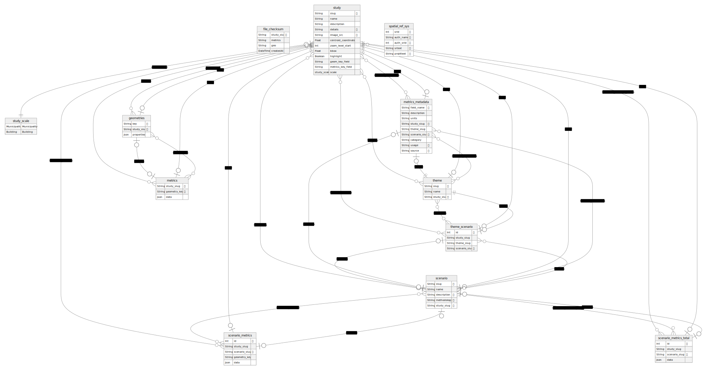

# Técnico Application

Based off of the [Vercel Postgres + Prisma Next.js Starter](https://vercel.com/templates/next.js/postgres-prisma). This utilizes the following tools:

- [Next.js](https://nextjs.org/) - React.js framework
- [Prisma](https://www.prisma.io/) - database modeling/ORM
- [Tailwind](https://tailwindcss.com/) - CSS framework

## Data Submission

Data is modeled with the following concepts:

- Study
- Theme: Belongs to study, represents a field of research for a given study.
- Scenario: A way that would modify the outcome of a theme.

To provide data, two files must be provided:

1. A XLSX spreadsheet file for a study, named `{study_identifier}.xlsx`
1. A GeoJSON file containing geometries associated with the study, named `{study_identifier}.geojson`

### Study Spreadsheet

The study spreadsheet must contain the following worksheets:

- `study`: metadata about the study. Column names are case insensitive and asterisks are removed prior to ingestion.
- `metrics`: raw data. the first column is expected to be the value used for matching geometries
- `metrics_metadata`

### Study Geometries

- `FeatureCollection` of `Polygon` or `MultiPolygon` values.
- Each `Feature` must contain a unique `id` property of either a string or integer.

## Development

### Install

```bash
pnpm install
```

### Setup database

To do a quick and dirty setup of our dev db (not using migrations):

```bash
# Push our DB schema to database
pnpm prisma db push
```

See [Schema prototyping with db push](https://www.prisma.io/docs/guides/migrate/prototyping-schema-db-push) for more information.

### Load data

#### Seeding

Seeding the database is the conventional entry to loading data into our application. Run it via:

```
pnpm prisma db seed
```

### Data Model




#### Buildings

To turn our Shapefile of buildings (`shapefile.shp`) in EPSG:32729 into a GeoJSON in EPSG:4326:

```bash
ogr2ogr -f GeoJSON -s_srs EPSG:32729 -t_srs EPSG:4326 buildings.geojson shapefile.shp
```

To insert these records into our local database:

```bash
# Convert our geojson to a CSV of building name, geometry, & properties (without building name) and pipe to postgres database
cat data/buildings.geojson | jq -r '.features[] | .properties.Name + ";" + (.geometry | tojson) + ";" + (del(.properties.Name) | .properties | tojson)' | psql tecnico -c "copy buildings from stdin (delimiter ';');"
```

You should see something like `COPY 5193` as output.

### Exploring data

Prisma ships with a [Prisma Studio](https://www.prisma.io/studio). It can be run via:

```
pnpm prisma studio
```

### Running the Application

Run Next.js in development mode:

```bash
pnpm dev
```

Deploy it to the cloud with [Vercel](https://vercel.com/new?utm_source=github&utm_medium=readme&utm_campaign=vercel-examples) ([Documentation](https://nextjs.org/docs/deployment)).
